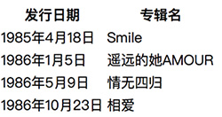

# HTML常用标签

## 一、`a`标签
`a`标签用于跳转到外部页面，跳转到内部锚点，或者跳转到邮箱或电话等。`a`标签常用的属性有`href`和`target`。  

`href`的取值有4种：
1. 网址，比如https://google.com
2. 路径，比如a/b/c
3. 伪协议
   * JavaScript:代码;
   * mailto:邮箱
   * tel:手机号
4. id，href=#***  

`target`常用的取值有2个：
1. `_blank`：表示在空白窗口打开链接
2. `_self`：表示在当前窗口打开链接

## 二、`img`标签
`img`标签用于发出get请求，展示一张图片。`img`标签常用的属性有`alt` `height` `width` `src`。  

`alt`用于当图片加载失败时，所展示的内容。

`src`用于指定图片的来源，可以是网址或者路径。

## 三、`table`标签
`table`标签用于展示一个表格。`table`标签相关的标签有
* `thead`：表的头部
* `tbody`：表的主体
* `tfoot`：表的尾部
* `tr`：表的一行
* `td`：表里的数据
* `th`：表头

```html
<table>
        <thead>
            <tr>
                <th>发行日期</th>
                <th>专辑名</th>
            </tr>
        </thead>
        <tbody>
            <tr>
                <td>1985年4月18日</td>
                <td>Smile</td>
            </tr>
            <tr>
                <td>1986年1月5日</td>
                <td>遥远的她AMOUR</td>
            </tr>
            <tr>
                <td>1986年5月9日</td>
                <td>情无四归</td>
            </tr>
            <tr>
                <td>1986年10月23日</td>
                <td>相爱</td>
            </tr>
   </tbody>
</table>
```
比如上面的代码可以展示如下图片的表格：

