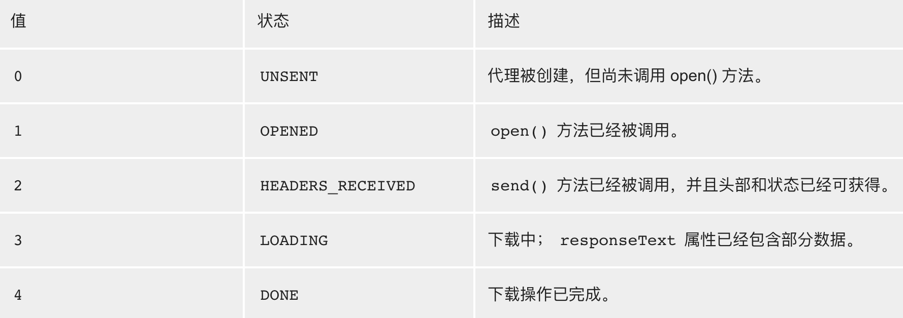

# AJAX 的原理

AJAX 的全称是 Async Javascript And XML 。AJAX 属于异步网络请求。简单地说，AJAX 就是用 JS 来发请求和收响应。

AJAX 带来的最大影响就是页面可以无刷新的请求数据。以往，页面表单提交数据，在用户点击完”submit“按钮后，页面会强制刷新一下，体验十分不友好。

## 准备服务器

为了方便演示，这里使用了提前写好的 server.js 文件，用来模拟服务器发请求和收响应。详细代码见文末。

在终端输入以下代码启动服务器：

```
node server.js 8888
```

这种方式在每次修改完代码后，需要断开服务器，然后再重新启动服务器，比较麻烦，不推荐使用。取而代之的是可以通过 `node-dev` 来启动服务器，这样每次修改完代码后，服务器会自动重新启动。

首先全局安装：

```
yarn global add node-dev
```

安装后输入以下代码启动服务器：

```
node-dev server.js 8888
```

## AJAX 的创建步骤

1. 创建 XMLHttpRequest 的对象，也就是创建一个异步调用对象。
2. 调用对象的 open 方法，创建一个新的 HTTP 请求，并指定该 HTTP 请求的方法、URL。
3. 监听对象的 onreadystatechange 事件。readyState 用来表示请求所处的状态，一个包括如下 5 个状态：
   
   当 readyState 的值为 4 时，表示浏览器已经把页面的所有内容下载完成。
4. 调用对象的 send 方法，发送请求。

下面通过一个具体示例来演示 AJAX 是如何创建的。

## 加载 CSS

通常加载 CSS 的方式是，在 HTML 的 head 标签里插入 `<link rel=stylesheet href="style.css"/>` 。现在让我们用 AJAX 的方式来加载 CSS 。

新建 public 文件夹，用来放我们要加载的文件。然后在这个文件夹里新建 1.css，即要加载的 css 文件。在 1.css 写上下面的代码：

```css
h1 {
  color: blue;
}
```

然后在 main.js 文件里使用 AJAX 的方式来加载这个 css 。为了演示方便，在 index.html 里加上了一个“请求css”的按钮，点击这个按钮就可以加载 1.css 文件。

```javascript
// 监听 “请求css” 按钮的点击事件，4个步骤创建 AJAX
getCSS.onclick = () => {
  const request = new XMLHttpRequest();
  request.open("GET", "/1.css");
  // 判断下载是否完成以及请求是否成功，都成功则加载 css ，否则提示 ”加载 CSS 失败“
  request.onreadystatechange = () => {
    if (request.readyState === 4) {
      if (request.status === 200) {
        const style = document.createElement("style"); // 创建 style 标签
        style.innerHTML = request.response; // 填写 style 内容， request.response 即为 1.css 的内容
        document.head.appendChild(style); // 插到 head 标签里面
      } else {
        alert("加载 CSS 失败");
      }
    }
  };
  request.send();
};
```

AJAX 创建完后，需要在 server.js 里添加 1.css 的路由：

```javascript
else if (path === "/1.css") {
    response.statusCode = 200;
    response.setHeader("Content-Type", "text/css;charset=utf-8");
    response.write(fs.readFileSync('public/1.css'));
    response.end();
```

这时，点击“请求css”的按钮，就可以加载 1.css 文件。

同理，按照以上创建 AJAX 的4个步骤，可以分别加载 2.js ，3.html ，4.xml 和 5.json 。


### 附：源代码链接
https://github.com/luodezhihkbu/ajax-demo