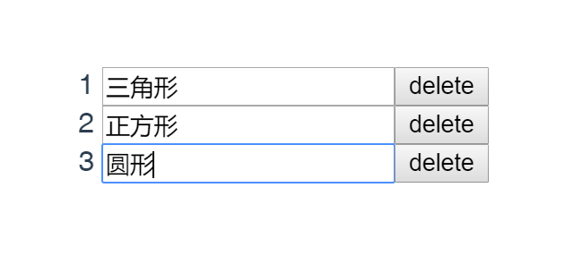
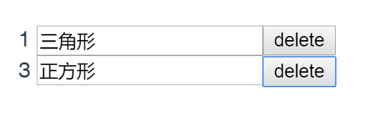

# 虚拟 DOM 和 DOM diff

## 1. 虚拟 DOM

虚拟 DOM 与真实的 DOM 对应，是一个能代表 DOM 树的对象，通常含有标签名、标签上的属性、事件监听和子元素们，以及其他属性。

虚拟 DOM 有两个优点：

1）减少 DOM 操作
  
虚拟 DOM 可以将多次操作合并为一次操作，比如你添加 1000 个节点，却是一个接一个操作的(减少频率）。

虚拟 DOM 还可以借助 DOM diff 可以把多余的操作省掉，比如你添加 1000 个节点，其实只有 10 个是新增的(减少范围)。

2）跨平台

虚拟 DOM 不仅可以变成 DOM，还可以变成小程序、 iOS 应用、安卓应用，因为虚拟 DOM 本质上只是一个 JS 对象。

虚拟 DOM 的缺点是需要额外的创建函数，如 createElement 或 h，可以通过 JSX 来简化成 XML 写法，但这种方法严重依赖打包工具。

## 2. DOM diff

DOM diff 就是虚拟 DOM 的对比算法，通过比较新旧虚拟 DOM 这两个对象的差异，只把变化的部分重新渲染，提高渲染效率。

可以把虚拟 DOM 想象成树形，DOM diff 有这样三种逻辑：

1）Tree diff  

将新旧两棵虚拟 DOM 树逐层对比，找出哪些节点需要更新。如果节点是组件就看 Component diff ，如果节点是标签就看 Element diff。

2）Component diff 

如果节点是组件，就先看组件类型。类型不同直接替换(删除旧的)，类型相同则只更新属性，然后深入组件做 Tree diff (递归)。

3）Element diff 

如果节点是原生标签，则看标签名。标签名不同直接替换，相同则只更新属性，然后进入标签后代做 Tree diff (递归)。

DOM diff 的缺点是在对比同级节点时，会出现识别错误的问题。比如在 Vue 的 v-for 中，如果没有绑定 key 的值，就会出 Bug 。

如图所示有三个输入框，如果点击第二个 delete ，最后的结果会变成下图这样，“正方形”这几个字并没有删除。

解决这个 Bug 的方法就是绑定 key 的值，但是不能用 index 作为 key 值，否则还是会出现上述的 Bug 。